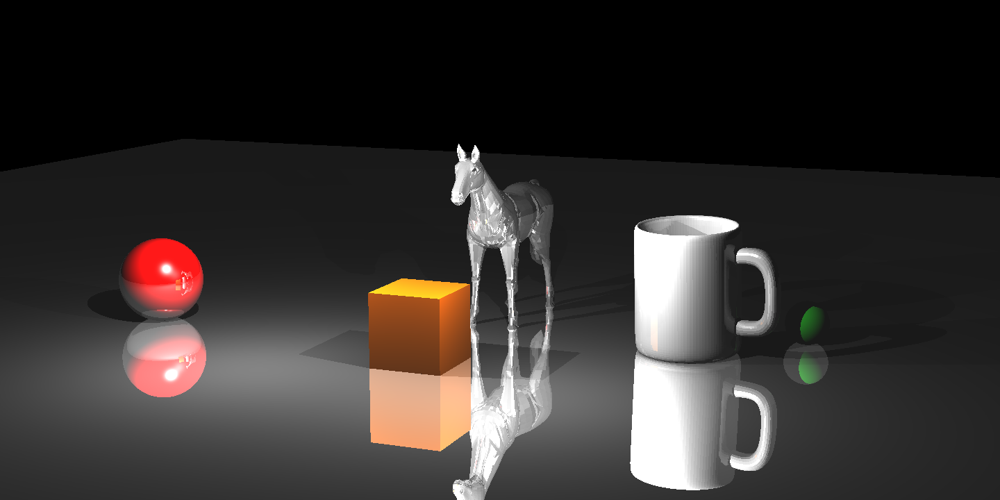

# raytracer

Run the following commands to get an output image in ppm format:  
`make`  
`./raytracer <input_scene>.xml`  

You can find input scenes in `input` folder.

Here are example outputs converted to png format (as GitHub doesn't support preview for ppm images):

